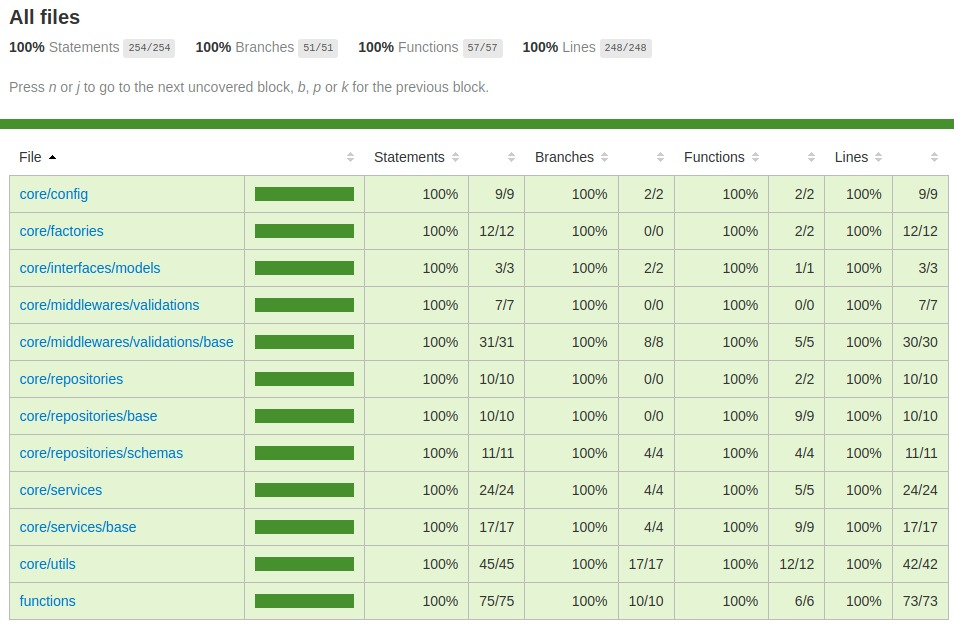

# Serverless + Mongo + Jest - Boilerplate

Model of project to work as base with Serverless.

This project was creates using this technologies.

[TYPESCRIPT](https://www.typescriptlang.org/)

[serverless-framework](https://www.serverless.com/)

[mongo-database](https://www.mongodb.com/)

[JEST](https://jestjs.io/)

[ESLint](https://eslint.org/)

[Prettier](https://prettier.io/)

## Índice

- [Índice](#índice)
- [Getting Started](#getting_started)
- [Testing](#testing)
- [project structure](#project_structure)

## Getting Started

### cloning this project using serverless command

```bash
sls install -u https://github.com/DaniiloLacerda/serverless-mongo-jest-boilerplate -n yourNameProject
```

### setting your mongo database and mongo express with docker compose

```bash
docker-compuse up -d
```

### install dependencies of project

```bash
npm i
```

## Testing

### run unit tests with JEST

```bash
npm rum test
```

### run coverage tests with JEST

```bash
npm rum testWithCoverage
```

### collection [](https://insomnia.rest/run/?label=&uri=https%3A%2F%2Fgithub.com%2FDaniiloLacerda%2Fserverless-mongo-jest-boilerplate%2Fblob%2Fmaster%2Fdocs%2Finsomnia.json)

### coverage in this project.



## project structure

```
.
├── config
│   └── serverless
│       └── functions
├── docs
├── src
│   ├── core
│   │   ├── config
│   │   ├── factories
│   │   ├── interfaces
│   │   │   ├── enum
│   │   │   ├── models
│   │   │   ├── requests
│   │   │   └── responses
│   │   ├── middlewares
│   │   │   └── validations
│   │   │       └── base
│   │   ├── repositories
│   │   │   ├── base
│   │   │   └── schemas
│   │   ├── services
│   │   │   └── base
│   │   └── utils
│   └── functions
└── test
    ├── helpers
    └── unit
        ├── core
        │   ├── config
        │   ├── factories
        │   ├── middlewares
        │   │   └── validations
        │   │       └── base
        │   ├── repositories
        │   │   └── base
        │   ├── services
        │   │   └── base
        │   └── utils
        └── functions
```
